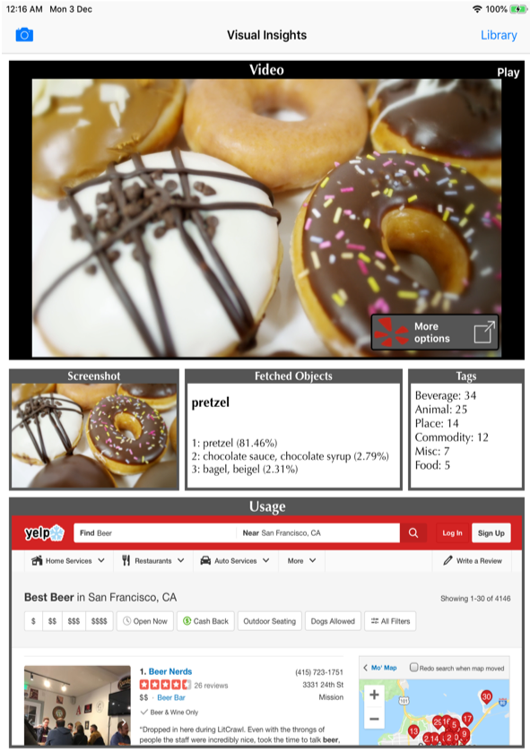

# DemoCoreML
DemoCoreML is sample app for which demonstrates machine learning & image recognition.

## Functional details:
* Created an app where a user can search for the nearest airports.
* The app captures screenshots from a playing video.
* The app processes the screenshots and fetches objects from the image.
* The app records and stores the objects from image.
* As an extra feature, app shows ads/articles/search results based on the object being identified. 
* Example: For object "alps", user sees Booking.com home page, For object "cats" user sees youtube video recommendations. 

## Implementation details:
* Video playback happens over AVPlayer. The video is placed locally in the app.
* The app captures screenshots from the playing video in regular and defined intervals.
* The app uses Google's Inceptionv3 model for image recognition. 

## Screenshots

